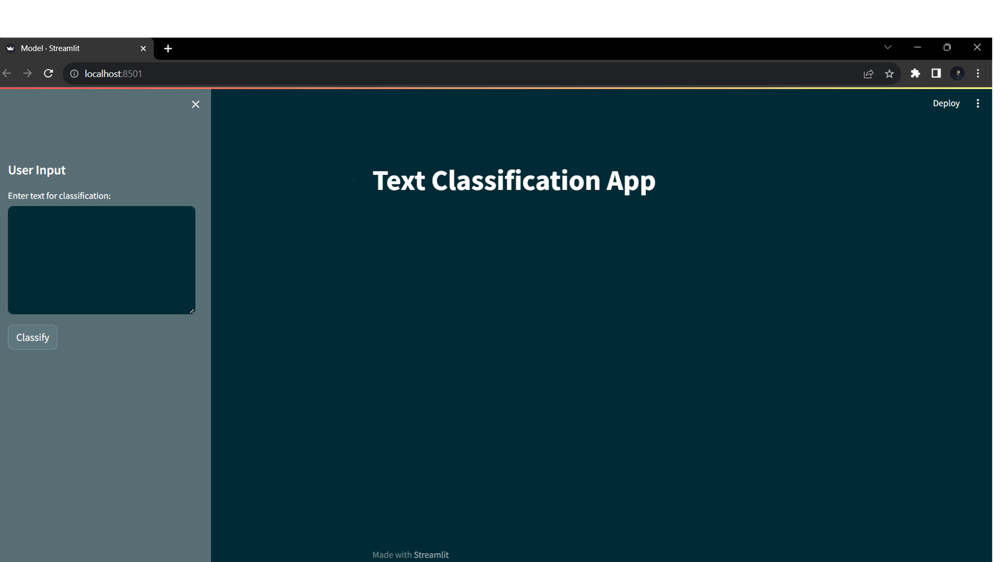
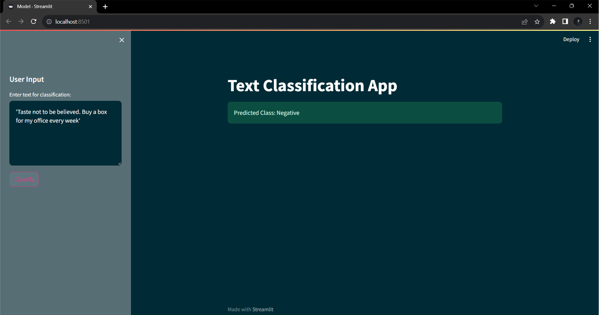
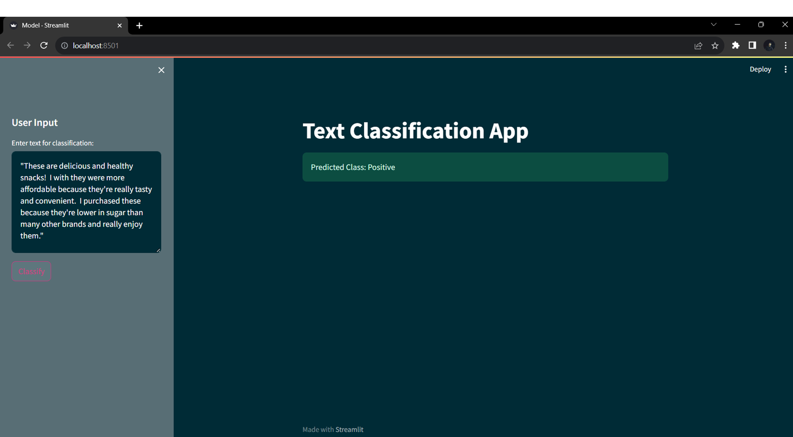

<h1 align="center">Title :Amazon Sentinmental Analysis Project</h1>

<div align= "center">
    <h3>Business Problem: Customer retention strategy through feedback analysis (Customer classification & clustering as an outcome of analyzing the review text).Trend & seasonality analysis to predict how frequently a particular category of customer would shop in the future.
</h3><br>
    
</div>


#### 1) Create environement
```
conda activate -p AMZ -y
```
#### 2) Create setup.py--> copy the code from my git hub repository
#### 3) Pip install requirements.txt file
```
pip install -r requirements.txt

```
#### 4) Create notebooks for 
##### i) Preprocessing_EDA
* Loaded data set MetaData and Prime Pantry Data
* Preprocess it and done EDA
* Applied NLP and done Sentimental Analysis with help of TextBlob Library
* Created three sentiments Negative, Neutral nad Positive
* Uploaded clean_data_final for further analysis
  
##### ii) ML_File
* Performed label encoding and vectorization
* Applied various model and compared accuracy
* Deployed it on streamlit app and check the result with sample comment by classifying it's sentiment
##### iii) Clustering_File
* Made cluster based on various clustering alogrithm.
* Based on it created three categories of people.
##### iv)TSA_File
* Perfomed on TSA on clean_data_final file
* Done all the required checks and gather various value for our model design part.
* Applied model and predcit future sentiments also.

#### 5) Created Model.py having final code for classifications of sentiment in:
* Negative
* Neutral
* Positive
#### 6) Copy the code from my gitHub repository for running streamlit app
* import clean_data_final.csv file
* copy whole code from Model.py

#### 7) Run the Model.py as-->streamlit run Model.py
```
streamlit run Model.py
```
#### 8) Streamlit app will open
#### 6) Insert your comment in the box and click on Classify Button





